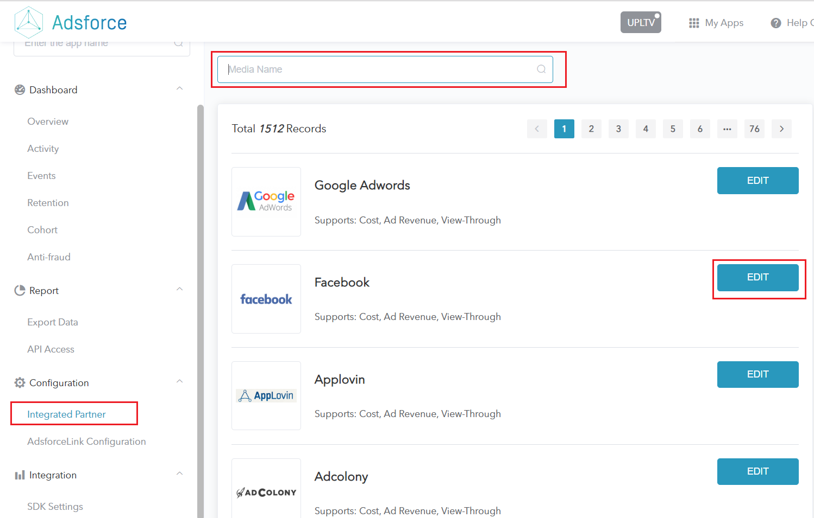
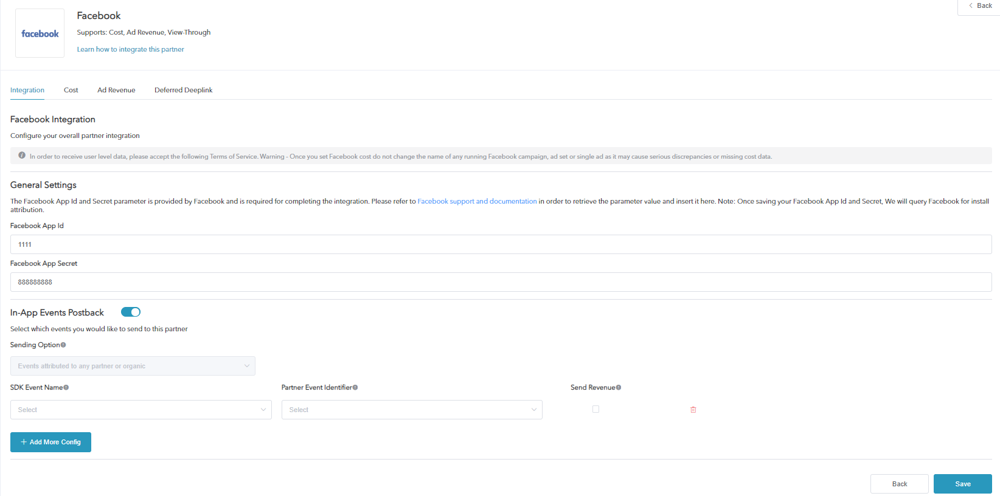
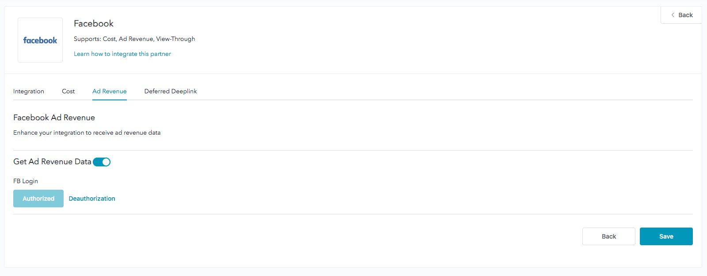
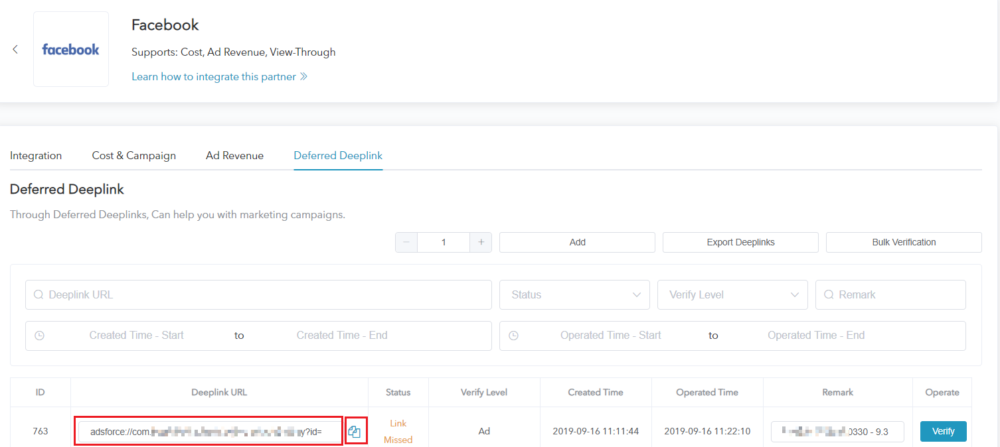
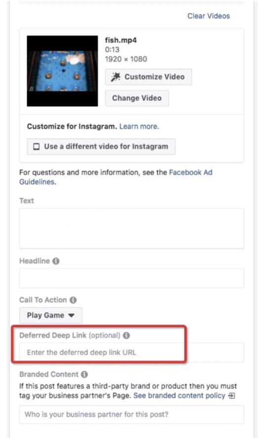
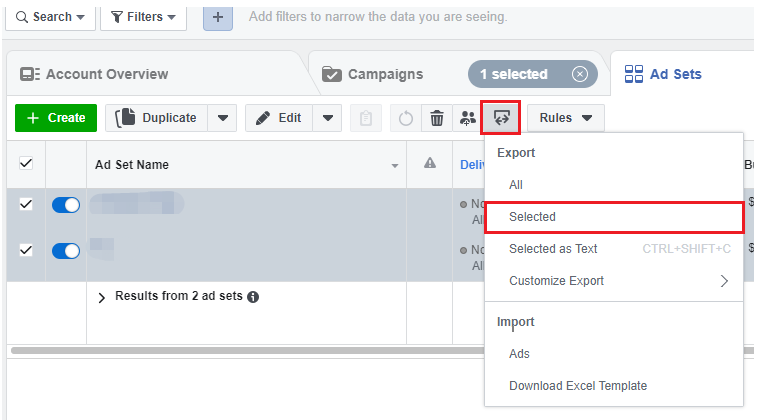
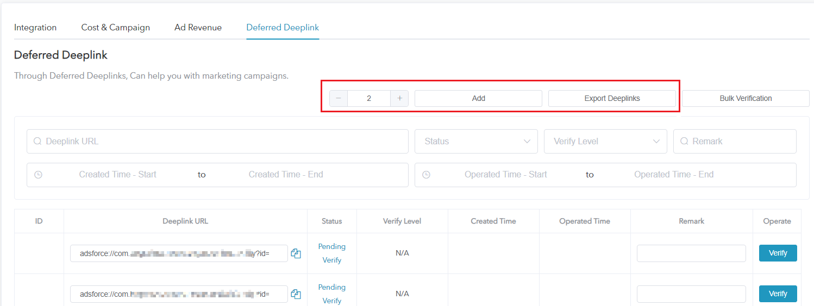
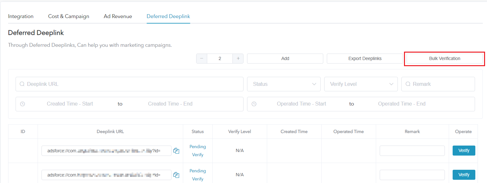
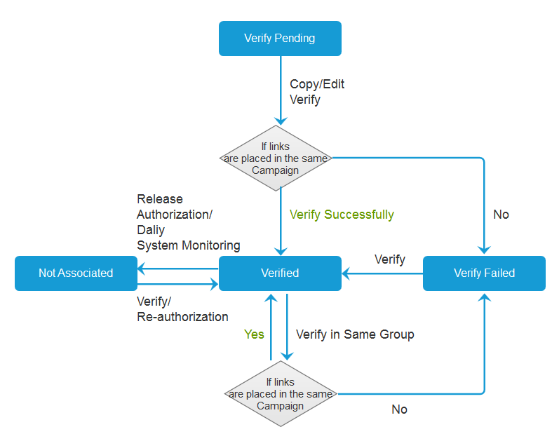

# How to Configure a Campaign with Facebook

* Facebook is one of Adsforce's integrated partners, providing advertisers with precise target users and user habits;
* In addition to click-based performance analytics, Facebook also supports other types of performance analytics such as cost, ad revenue, and view-through.

## Facebook Integration

Follow the steps below to configure Facebook.

### Set Up Facebook

###### 1. [Login Adsforce](https://demo-portal.adsforce.io/login)；

###### 2. Click your App under "My Apps";

###### 3. Under "Configuration" > "Integrated Partner ", search "Facebook" and click "EDIT";

###### 4. Go to **Facebook's** configuration window.

 

Facebook's configuration window includes 4 options: `Integration`, `Cost`, `Ad Revenue`and `Deferred Deeplink`.

### Facebook Integration

###### 1. Enter [Facebook App ID and Secret](facebook-app-id-facebook-app-secret-configuration/README.md)；

###### 2. Select and configure Facebook In-app Events (if needed).

 

> **[success] Tip**
>
> **In-App Events Postback**  
>
> *Facebook only supports for sending all in-app events in collaboration platform.*
>
> * Select `Only event attributed to this partner` for events coming **only** from users attributed to Facebook;
> * Select `Event attributed to any partner or oranganic` to have your **entire** user base available to be reported to Facebook.
>
> **Event Name**
>
> * When you first enable an in-app event in Facebook, the SDK will be automatically mapped to Facebook's predefined event list;
> * The name of the event is received from SDK integrated in the App or from the server event;
> * Click "Add Event", the partner event identifier will be added by default;
> * When "Send Revenue" is not selected, Adsforce will send all parameters of the in-app event to the partner, with the exception of the revenue value;
> * When "Send Revenue" is selected, Adsforce will send all parameters, including the revenue value;
> * The updated data window will take effect immediately after saving.

### Cost Configuration

Your Facebook cost data can be enhanced through cost integration.

> **[info] Important**
>
> Make sure Facebook is authorized before enabling Facebook cost data.

 

###### 1. Get Cost Data

   To get Facebook cost data, you need to turn on **Get Cost Data**.

###### 2. Bind Facebook

&ensp;&ensp;1) Click **Go to Facebook Authorization** to authorize Facebook;

&ensp;&ensp;2)  Use Facebook's Business advertising account to authorize.
> **[info] Important**
>If you have more than 10 advertising accounts, bind the corresponding App advertising account for more quickly read data.

### Ad Revenue

Ad revenue data can be received from Facebook Audience Network through Ad revenue integration.

> **[info] Important**
>
> Make sure Facebook is authorized before enabling Facebook advertise revenue.

 

###### 1. Getting Ad Revenue Data

  To get Facebook Ad revenue data, you need to turn on **Get Ad Revenue Data**.

###### 2. Binding Facebook

   Click **Facebook Authorization** to enter the Facebook authorization page.

### Deferred Deeplink

Deeplink is available for marketing activities.

The deferred deeplink can be verified individually or manually by bulk in the following two ways:

#### Verify A Deferred Deeplink Individually

###### 1. Pass [Facebook authorization](javascript:;);

###### 2. Automatically generate a link for you;

> **[warning] Note**
>
> You can directly edit the deeplink URL and copy the link by clicking .

###### 3. Paste the copied Deferred Deeplink to the "Deferred Deep Link" in Facebook by logging in your Facebook account > Creating a campaign > Creating Ad Groups > Creating an adset > selectng an Ad in Ad;

###### 4. In the Adsforce Dashboard > “Configuration” > “Integrated Partner” > “Facebook” page, click Verify to verify if the deferred deep link is related.

> **[warning] Note**
>
> * The link to be verified should correspond to the link pasted into the Facebook account (Facebook Account > Ad > "Delayed Deep Link");
> * You can verify the link by clicking "Verify";
> * The status shows "Verified", indicating that the configuration is completed;
> * After directly copying or editing the generated deferred deeplink, paste the link to the specified location of the Facebook account Ad;
> * Different Campaigns cannot share the same deferred deeplink;
> * The updated data window will take effect after being saved.

#### Verify Deferred Deeplinks In bulk

###### 1. Check the Ad and select Selected under Export & Import to export the Ads in bulk;
######  

###### 2. In the Adsforce Dashboard > “Configuration” > “Integrated Partner” > “Facebook” page, add and export deeplinks ;

###### 3. Paste the exported links under the Mobile App Deep Link;

###### 4. Select Ads to import the Excel into Facebook in bulk;

###### 5. Return to the Adsforce's “Facebook” configuration page, click Bulk Verification to verify the links and Facebook's Ad ID will be generated automatically in Remark.

### Verify Links Status Process

> **[success] Tip**
> 
> - Blue rectangle symbol indicates the status;
> 
> - White diamond symbol indicates the system judgment;
> 
> - Black fonts indicate the operation and system operation.
