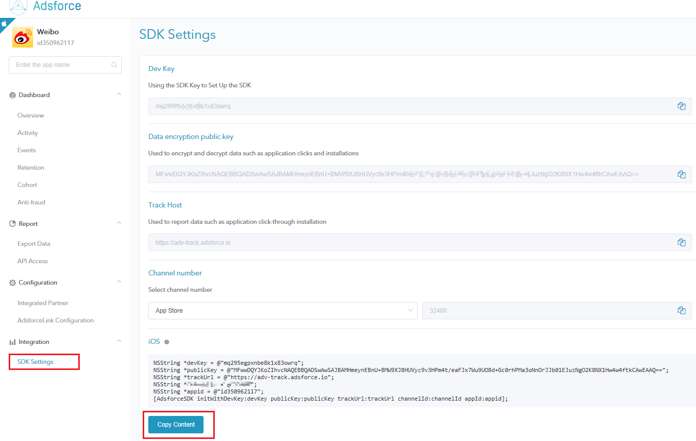

# Adsforce Android SDK

## Android SDK Integration

|                         |                                                              |
| :---------------------: | :----------------------------------------------------------: |
|  |  <br><br>**SDK Version:** <span style="color: blue;">1109</span> ([Release Notes](/sdk-integrations/quick-start/Changelog/README.md)) |


## Overview

Adsforce's SDK provides App installation and event tracking functionality. 

You can track installs, updates and sessions and also track additional in-app events beyond app installs (including in-app purchases, game levels, etc.) to evaluate ROI and user engagement levels.

## Android SDK Integration

> **[info] Important**
>
> *Before integrating Android SDK, you should confirm:*
>
> - You have added your [App](../../../get-started/add-apps/README.md) to the Adsforce dashboard;
>
> - You have got **SDK API Key**.

Methods of getting **Android SDK API Key** are as follows:

###### 1. [Login Adsforce](https://demo-portal.adsforce.io/login)；

###### 2. Click your App under "My Apps";


###### 3. Under "Integration" > "SDK Settings", click "Copy Content" to copy SDK API key.



### Add the SDK to your Project

###### 1. Unzip [Adsforce SDK](sdk-download/README.md)


###### 2. Download `AdsforceSdk_xxx.aar`  and `installreferrer_xxx.jar` , then import them into `libs` directory in your project.  


> **[success] Tip**
>
> - `File `installreferrer_xxx.jar` is Provided by Google, a reliable way to securely retrieve install referral content;
> - Using this API, your app will get precise information straightly from the Play Store.


- If you use `Android Studio` to build project，please add the following compile statement to your app-level build.gradle (not project!).


   ```groovy
   repositories {
       flatDir {
           dirs 'libs'
       }
   }
   
   dependencies {
       compile(name: 'AdsforceSdk_xxx', ext: 'aar')
       compile(name: 'installreferrer_x.x.x', ext: 'jar')
       compile 'com.google.android.gms:play-services-base:15.0.1'
   }
   ```

- If using a development tool that doesn't support the `gradle`  and you can use the `aar` file, we can provide you with a play-services-base dependency library file. You can download the files and add them to your project.
  
- If using a development tool that doesn't support the `aar` file and the `play-services-base` dependent library cannot be used in this case, you can simply import the `installreferrer_xxx.jar` file, unzip the `AdsforceSdk_xxx.aar` ,then rename the `classes.jar` and import it into the project. Finally copy the following codes into `AndroidManifest.xml` file of your project.
  
     ```xml
     <uses-permission android:name="android.permission.INTERNET"/>
     <uses-permission android:name="android.permission.ACCESS_NETWORK_STATE"/>
     <uses-permission android:name="android.permission.ACCESS_WIFI_STATE"/>
     <uses-permission android:name="com.google.android.finsky.permission.BIND_GET_INSTALL_REFERRER_SERVICE" />
     ```
     
     

### **Initialize the SDK**

###### 1. Please  your App on **[Portal](https://tmp-portal.adsforce.io/login)**;

###### 2. Get the SDK from SDK Settings page;

&ensp;&ensp;1) Click your App to be configured;


&ensp;&ensp;2) Click "Integration" > "SDK Settings";


&ensp;&ensp;3) Refer to the initialization code generated by the website.


###### 3. Initialize `AdsforceSdk` in the `Application.onCreate()`.

**Sample code:**


     public class MyApplication extends Application {
     
         @Override
         public void onCreate() {
             super.onCreate();
             AdsforceSdk.initSdk(this, "<your_dev_key>","<your_public_key>", "https://<your_track_host>/", "<your_channel_id>");
     	}
     }


### **DeepLink**

If you want to know the `OneLink` information , you can call the following code to get the user's `OneLink` information after initialization.

    AdsforceSdk.getOneLink(getApplicationContext(), new AdsforceOneLinkCallback() {
                        @Override
                        public void onOneLinkCallback(String oneLink) {
                            if (oneLink != null) {
                                Log.i(TAG, "referrer oneLink is " + oneLink);
                            } else {
                                Log.i(TAG, "referrer oneLink is null");
                            }
                        }
                    });


​     
In-app Purchase Report
---------------------------

If the IAP (in-app purchase) uses the `google payment`, you can call one of the following methods to report this payment.

Method One (Recommend)
```
     /**
      * Recommend you to call the method below to report the in-app purchase record (Google-  certified)
      *
      * @param skuDetailJson  IAP skudetail json, can not be empty
      * @param publicKey      Public key of Google payment，can be empty
      * @param dataSignature  Signature verification from GP payment, get from Purchase.getSignature()，can not be empty
      * @param purchaseData   Signature verification from GP payment, get from Purchase.getOriginalJson()，can not be empty
      * @param params         Other params，can be empty
      */
    public static void googleZFReportWithSkuDetailJson(string skuDetailJson, string publicKey, string dataSignature, string purchaseData, Dictionary<string, string> map);
```

Method Two
```
    /**
      * Or you can call the follwing method to report the in-app purchase record (Google-certified)
      *
      * @param price          Payment amount, recommended to take from the 'price' field of Skudetail, must be more than 0
      * @param currency       Payment currency，Payment amount, recommended to take from the 'price_currency_code' field of skudetail, can not be empty
      * @param publicKey      Public key of Google payment，can be empty
      * @param dataSignature  Signature verification from GP payment, get from Purchase.getSignature()，can not be empty
      * @param purchaseData   Signature verification from GP payment, get from Purchase.getOriginalJson()，can not be empty
      * @param params         Other params，can be empty
      */
     AdsforceSdk.googleZFReportWithProductPrice(double price, @NonNull String currency, String publicKey, @NonNull String dataSignature, @NonNull String purchaseData, Map<String, String> params);
```


> **[warning] Note**
>
> This method must be called after initializing the SDK.

In-app Purchase Report for Third-party
--------------------------------

If the IAP (in-app purchase) uses the `third-party payment`, you can call the following method to report this payment.

    /**
     * In-app purchase record(custom)
     *
     * @param price        Payment amount, recommended to take from the 'price' field of skudetail, can not be empty
     * @param currency     Payment currency，Payment amount, recommended to take from the 'price_currency_code' field of skudetail, can not be empty
     * @param productId    Id of product，recommended to take from the 'productId' field of skudetail，can not be empty
     * @param productType  Type of product，recommended to take from the 'type' field of skudetail，can not be empty
     */
    
    AdsforceApi.thirdZFReportWithProductPrice(string price, string currency, string productId, string productType)

> **[warning] Note**
>
> This method must be called after initializing the SDK.

Custom Event Report
-------------------

Depending on the type of the reported parameters, you can select one of the following three methods for reporting.

Method One

```
 /**
  * Custom event report
  *
  * @param key   Key of event
  * @param value Data for reproting
  */
 AdsforceSdk.customerEventWithValue(String key, String value);
```

Method Two

 ```
 /**
  * Custom event report
  *
  * @param key Key of event
  * @param map Use HashMap for reproting
  */
 AdsforceSdk.customerEventWithMap(String key, HashMap<String, String> map);
 ```

Method Three
 ```
 /**
  * Custom event report
  *
  * @param key  Key of event
  * @param list Use Arraylist for reproting
  */
 AdsforceSdk.customerEventWithList(String key, ArrayList<String> list);
 ```

> **[warning] Note**
>
> Please call this method must be called after SDK initialization.

Set AndroidId
-------------

> **[warning] Note**
>
> Please call this method must be called before initializing the SDK.

In order to ensure the accuracy of the data , Please ensure that the users' privacy is not revealed and call the following method to pass the `AndroidId` to us.

     AdsforceSdk.setAndroidId(getApplicationContext(), getAndroidId());

   


