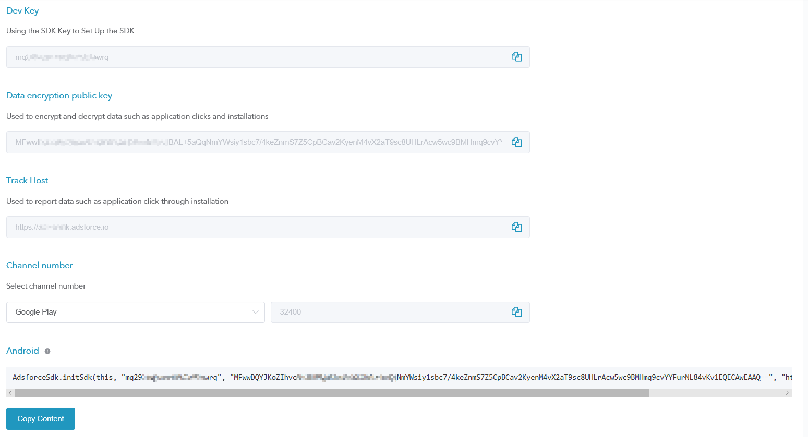

# Adsforce Unity SDK 集成


|                                                           |                                                              |
| :-------------------------------------------------------: | :----------------------------------------------------------: |
|  |  <br><br>**SDK Version:** <span style="color: blue;">v1109</span> ([Release Notes](/sdk-integrations/quick-start/Changelog/README.md)) |


## Overview
Adsforce's SDK provides App installation and event tracking functionality for Android and iOS.

You can track installs, updates and also track post-installs events (including in-app purchases, etc.) to evaluate ROI and user engagement levels.

Mobile apps, that are developed on the Unity platform, can enjoy integrating Adsforce's SDK once and tracking both Android and iOS generated apps. The following guide details how to integrate Adsforce's SDK into your Unity code for your iOS and Android apps.

## Quick Start

### Download 'adsforce_unity.unitypackage' File

Set out below are the integration instructions for using Adsforce’s Unity Plugin.

### Installing the Plugin
Set out below are the installation instructions for the Adsforce's plugin:

###### 1. Import the export_adsforce_both.unitypackage into your Unity project. 
###### 2. Go to Assets > Import Package >  Custom Package Select export_adsforce_both.unitypackage file.
## SDK Initialization
###### 1. Add your [App](../../../get-started/add-apps/README.md) to the **[Adsforce](https://tmp-portal.adsforce.io/login)**;

###### 2. Get the SDK from SDK Settings page (take Andriod as an example);

&ensp;&ensp;1) Click your App to be configured;


&ensp;&ensp;2) Click "Integration" > "SDK Settings";


&ensp;&ensp;3) Apply for the parameters of `devKey`, `publicKey`, `trackUrl`, `channelId` and `appid` from the website.



###### 3. In your Start / Init methods, you can set your_dev_key, your_public_key, your_track_host, your_channel_id and unique app IDs used by iTunes.

```
void Start () {
#if UNITY_IOS && !UNITY_EDITOR
    AdsforceApi.initAdsforceSDK ("<your_dev_key>", "<your_public_key>",
"<your_track_host>", "<your_channel_id>", "<your_appid>");

#elif UNITY_ANDROID && !UNITY_EDITOR
    AdsforceApi.initAdsforceSDK ("<your_dev_key>","<your_public_key>",
    "<your_track_host>", "<your_channel_id>", "");

#endif
}
```

Tracking Revenue
----------------

### About IAP for Android

If the in-app purchase uses the google payment, you can call the following method to report this payment.
```
/**
 * In-app purchase record(Google-certified)
 *
 * @param price          Payment amount, recommended to take from the 'price' field of skudetail, can not be empty
 * @param currency       Payment currency，Payment amount, recommended to take from the 'price_currency_code' field of skudetail, can not be empty
 * @param publicKey      Public key of Google payment，can not be empty
 * @param dataSignature  Signature verification from GP payment, get from Purchase.getSignature()，can not be empty
 * @param purchaseData   Signature verification from GP payment, get from Purchase.getOriginalJson()，can not be empty
 * @param map            Other map, can be empty
 */

 AdsforceApi.googleZFReportWithProductPrice(string price, string currency, string publicKey, string dataSignature, string purchaseData, Dictionary<string, string> map)
```

### About IAP for iOS

If the in-app purchase uses the appstore payment, you can call the following method to report this payment.
```
/**
 * In-app purchase record(iOS)
 *
 * @param productPrice          such as 6.00

 * @param productCurrencyCode   such as CNY
 * @param receiptDataString     such as your receipt data string 
 * @param pubkey                such as 48a07332496a4bcb9eea4d32e1234582(if subscription                                 is included, please ask the PM for PubKey; 
                                Or you can fill in nill)
 * @param map                   Other map, can be empty
 */

AdsforceApi.appStoreWithProductPrice(string productPrice, string productCurrencyCode, string receiptDataString, string pubkey, Dictionary<string, string> map)
```

### About IAP for Third-party
If the in-app purchase uses the third-party payment, you can call the following method to report this payment.
```
/**
 * In-app purchase record(custom)
 *
 * @param price        Payment amount, recommended to take from the 'price' field of skudetail, can not be empty
 * @param currency     Payment currency，Payment amount, recommended to take from the 'price_currency_code' field of skudetail, can not be empty
 * @param productId    Id of product，recommended to take from the 'productId' field of skudetail，can not be empty
 * @param productType  Type of product，recommended to take from the 'type' field of skudetail，can not be empty
 */

 AdsforceApi.thirdZFReportWithProductPrice(string price, string currency, string productId, string productType)
```

## Tracking In-App Events
Depending on the type of the reported parameters, you can select one of the following three methods for reporting.

```
/**
 * Custom event report
 *
 * @param key   Key of event
 * @param value Data for reproting
 */
AdsforceApi.customerEventWithValue(string key, string value);

/**
 * Custom event report
 *
 * @param key  Key of event
 * @param list Use Arraylist for reproting
 */
AdsforceApi.customerEventWithList(string key, List<string> list);

/**
 * Custom event report
 *
 * @param key Key of event
 * @param map Use HashMap for reproting
 */
AdsforceApi.customerEventWithMap(string key, Dictionary<string, string> dic);
```

## Tracking Deep Linking
If you want to know the deeplink information , you can call the following code to get the user's deeplink information after initialization.
```
Action<AdsforceDeepLinkBean> callback = new Action<AdsforceDeepLinkBean> (deeplinkCallback);
AdsforceApi.getDeepLink (callback);
```

## Set AndroidId (Only for Android)
In order to ensure the accuracy of the data , Please ensure that the privacy of the user will not be revealed and call the following method to pass the AndroidId to us.
```
AdsforceApi.setAndroidId(string AndroidId);

```
