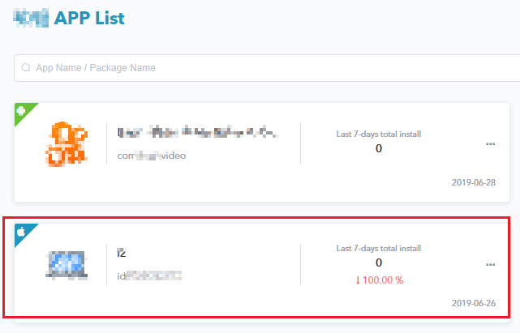

# Adsforce iOS SDK

## iOS SDK Integration

|                 |                                                              |
| :-------------: | :----------------------------------------------------------: |
|  |  <br><br>**SDK Version:**  <span style="color: blue;">1109</span> ([Release notes](/sdk-integrations/quick-start/Changelog/README.md)) |


Project Configuration
---------------------

Add `-ObjC` into `TARGETS` → `Build Setting` → `Linking` → `Other Linker Flags` .


SDK Initialization
------------------

### Initialization Methods

###### 1. Add your [App](../../../get-started/add-apps/README.md) to the **[Adsforce](https://tmp-portal.adsforce.io/login)**;

###### 2. Get the SDK from SDK Settings page;

&ensp;&ensp;1) Click your App to be configured;



&ensp;&ensp;2) Click "Integration" > "SDK Settings";


&ensp;&ensp;3) Apply for the parameters of `devKey`、`publicKey`、`trackUrl`、`channelId`、`appid` from the Adsforce dashboard.


###### 3. Set`devKey`, `publicKey`, `trackUrl`, `channelId` and `appid`, initialize `AdsforceSdk`.

```
 **Sample code:**

// Setting parameters
NSString *devKey = @"your devKey";
NSString *publicKey = @"your publicKey";
NSString *trackUrl = @"your trackUrl";
NSString *channelId = @"your channelId";
NSString *appid = @"your appid";

// init SDK
[AdsforceSDK initWithDevKey:devKey publicKey:publicKey trackUrl:trackUrl channelId:channelId appId:appid];
```

### Initialization Time

The time to initialize SDK should be set in a relative earlier position, such as in AppDelegate’s (BOOL)application:(UIApplication *)application didFinishLaunchingWithOptions:(NSDictionary *)launchOptions

## DeepLink

After initialization, relevant information about OneLink can be fetched asynchronously  through this method.

```objective-c
[AdsforceSDK setOnelinkCallback:^(NSString *link) {
    NSLog(@"onelink:%@",link);
}];
```

## In-app Purchase Report

After initialization, you should use this method to upload IAP information.

```objective-c
NSString *receiptDataString = @"your receipt data string";
NSNumber *productPrice = [NSNumber numberWithDouble:your price];
NSString *productCurrencyCode = @"your product currency code";
NSString *pubkey = @"your itunes connect pubkey";

[AdsforceSDK appStoreWithProductPrice:productPrice productCurrencyCode:productCurrencyCode receiptDataString:receiptDataString pubkey:pubkey params:nil];

```
Parameters are as follows:

- `receiptDataString`  such as`your receipt data string`
- `productPrice` such as`6.00`
- `productCurrencyCode` such as `CNY`
- `pubkey`  such as`48a07332496a4bcb9eea4d32e1234582`(If a subscription function is included in the game, you need to ask the project manager for the PubKey; otherwise, you can fill in "nil" directly)

## In-app Purchase Report for Third-party

After initializating, you should use this method to upload IAP information after Third Pay process.

```objective-c
NSNumber *productPrice = [NSNumber numberWithDouble:your price];
NSString *productCurrencyCode = @"your product currency code";
NSString *productIdentifier = @"your product id";
NSString *productCategory = @"your product category";

[AdsforceSDK thirdZFLogReportWithProductPrice:productPrice productCurrencyCode:productCurrencyCode productIdentifier:productIdentifier productCategory:productCategory];
```

Parameters are as follows:

- `productPrice` such as `6.00`
- `productCurrencyCode `such as `CNY`

Custom Event Report
-------------------

Depending on the type of the reported parameters, you can select one of the following three methods for reporting.

Method One

```
+ (void)customEventWithKey:(NSString *)key stringValue:(NSString *)value;
```
Method Two
```
+ (void)customEventWithKey:(NSString *)key arrayValue:(NSArray<NSString *> *)value;
```

Method Three
```
+ (void)customEventWithKey:(NSString *)key dictionaryValue:(NSDictionary<NSString *,NSString *> *)value;
```
> **[warning] Note**
>
> Please call this method must be called after initializing the SDK.
