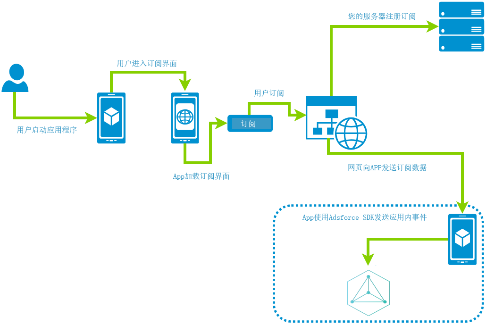
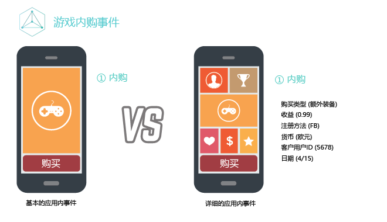

# 介绍

​     Adsforce 应用内事件可以让广告主追踪应用安装后事件将其归入原始媒体渠道。

​     如果您的用户进行注册、将商品添加至购物车或进行购买等，应用内事件可显示相关数据。

​     **应用内事件可以确认用户价值以及不同的媒体渠道所带来的流量与质量**。使用应用内事件可以让广告平台高效优化网络流量，因此 Adsforce 强烈建议您使用应用内事件。  



# Trackevent API

​         应用内事件由事件名称和事件参数组成。

​         您可以选择已有的事件名称。但 Adsforce 的 SDK 是通过枚举和定义推荐事件名称 。

​         事件名称区分大小写, 例如, 发送 xh_purchase 和 xh_PURCHASE 两个事件名称将创建两个单独的事件。

​         语法：

### **iOS**

```
- (void) trackEvent:(NSString *)eventName withValues:(NSDictionary*)values 
```

-  eventName         

  用于定义事件名称的任何字符串。         

- 值

  组成详细事件的事件参数。

### **Android**

```
public static void trackEvent(Context context, String eventName, Map eventValues)
```

-  Context

  使用 `getApplicationContext()`

- eventName

  用于定义事件名称的任何字符串。

- eventValues

  组成详细事件的时间参数。


# 重要



### **收益参数**

​         您可以使用任何参数和事件发送收益值。但是必须使用 **xh_revenue** 参数在 Adsforce 的原始和聚合数据中注册收益 。使用此参数能够真实的展示获得收益的应用内事件。

### **多个商品**

​         您可以在单笔交易中添加多个商品，用逗号隔开多个商品描述，无需让每个事件参数对应。

 **示例**

​         在同一笔交易中，A. Force 先生从某家美国线上商店购买了两件完全一样的衬衫，一双鞋和一顶帽子。

​         列明各商品的序列必须与各参数完全一致。

​         `xh_content_id: ["123","988","399"]`
         `xh_quantity: [2,1,1]`
         `xh_price: [25,50,10]`
         `xh_revenue: [110]`
         `xh_currency: USD`

​         对于多个商品，代码显示如下：

```
Map<String,Object> eventData = new HashMap<>();
eventData.put(xhInAppEventParameterName.CONTENT_ID, new String[] {"123","988","399"});
eventData.put(xhInAppEventParameterName.QUANTITY, new int[] {2, 1, 1});
eventData.put(xhInAppEventParameterName.PRICE,new int[] {25, 50, 10});
eventData.put(xhInAppEventParameterName.CURRENCY,"USD");
eventData.put(xhInAppEventParameterName.REVENUE,110);
AdsforceLib.getInstance().trackEvent(AdsforceTestActivity.this, xhInAppEventType.PURCHASE,eventData);
```

**注意**

​         多商品描述可以在以下应用内事件中使用：
         `xh_add_to_cart`、`xh_add_to_wishlist`、`xh_tutorial_completion`、`xh_initiated_checkout`、    

​         `xh_purchase`、`xh_rate`、`xh_spent_credits `、`xh_content_view`、`xh_travel_booking`、`xh_update`

### 复杂应用内事件

​         复杂应用内事件可以允许一个API调用多个发送事件。

​         复杂应用内事件能有效查看关联密切的用户操作，例如在单个会话中将若干产品添加到购物车。

**示例**：

```
{
  "xh_revenue":"50.87",
  "xh_currency":"USD",
  "xh_receipt_id":"57601333",
  "product":[ 
   { 
     "xh_content_id":"1164_8186",
     "xh_price":"8.97",
     "xh_quantity":"1"
   },
   { 
     "xh_content_id":"1164_8186",
     "xh_price":"8.97",
     "xh_quantity":"1"
   },
   { 
     "xh_content_id":"1164_8186",
     "xh_price":"8.97",
     "xh_quantity":"1"
   },
   { 
     "xh_content_id":"1177_8185",
     "xh_price":"8.97",
     "xh_quantity":"1"
   },
   { 
     "xh_content_id":"0153_9077",
     "xh_price":"14.99",
     "xh_quantity":"1"
   }
  ]
}
```

### 警告

​         复杂应用内事件会引起 Facebook 和 Criteo 出现回传问题。如果您需要事件与 Facebook 和 Criteo 全部展示，您可以按照各用户操作发送单独事件。

​         例如按照各添加的商品发送到”添加到购物车“应用事件，应用内事件将会把这些事件分为一组。

### 离线追踪事件

​         如果用户在网络连接不可用时启动了事件，Adsforce仍可追踪该事件. 以下是其原理:

1. SDK 将事件发送到 Adsforce 服务器并等待响应。
2. 如果 SDK 没有收到响应200, 则该事件将存储在缓存中。
3. 收到下一个响应200后, 存储的事件将重新发送到服务器。
4. 如果缓存中有多个事件, 将按序号发送到服务器。

### 注意

​         SDK 的缓存最多可以存储40个事件, 这意味着只保存脱机发生的前40个事件。之后所有的事件都会被丢弃，直到下一个相应200。

### 事件去重

​         Adsforce 有一套应用内事件去重的机制。它会检查所有应用内事件，以查看同一个 Adsforce_id 是否10秒内有同一个应用内事件。如果找到此类事件, 该机制将删除重复项。

​         如果两个事件中的以下字段相同, 则两个事件被视为相同:

- eventName
- Event value
- App ID
- Adsforce ID

### 注意

​         去重工作仅适用于从 SDK 发送的应用内事件。

​         服务器对服务器的应用内事件不会去重。