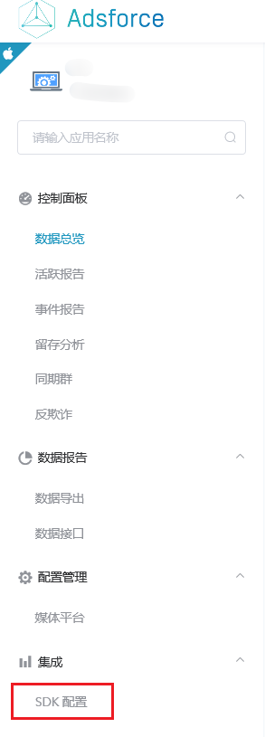
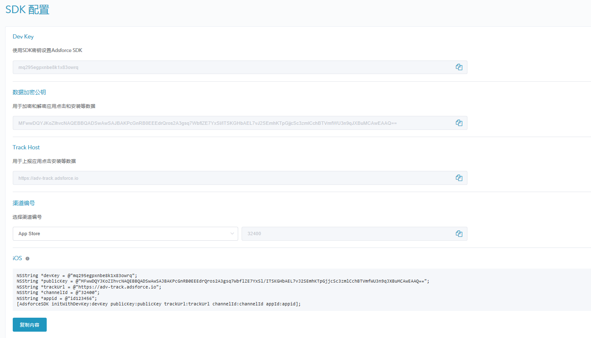

# Adsforce iOS SDK

## 集成 iOS SDK

|                 |                                                              |
| :-------------: | :----------------------------------------------------------: |
|  |  <br><br>当前版本：<span style="color: blue;">v1109</span>（[发布说明](/sdk-integrations/quick-start/Changelog/README.md)） |


## 项目配置

添加`-ObjC` 至 `TARGETS` → `Build Setting` → `Linking` → `Other Linker Flags`。


## SDK初始化

### 初始化方式

###### 1. 在**[Adsforce](https://tmp-portal.adsforce.io/login)**上[创建应用](../../../get-started/add-apps/README.md)；

###### 2. 并在所创建的 SDK 配置页面获取 SDK 配置参数；

&ensp;&ensp;1）单击选择需配置的应用；


&ensp;&ensp;2）单击“集成 > SDK 配置”；



&ensp;&ensp;3）在 SDK 配置页面，获取`devKey`、`publicKey`、`trackUrl`、`channelId`和`appid`参数。



###### 3. 设置`devKey`、`publicKey`、`trackUrl`、`channelId`和`appid`参数并初始化`AdsforceSdk`。

```
 **示例代码：**

// Setting parameters
NSString *devKey = @"your devKey";
NSString *publicKey = @"your publicKey";
NSString *trackUrl = @"your trackUrl";
NSString *channelId = @"your channelId";
NSString *appid = @"your appid";

// init SDK
[AdsforceSDK initWithDevKey:devKey publicKey:publicKey trackUrl:trackUrl channelId:channelId appId:appid];
```

### 初始化时间

初始化SDK时间应设置在相对较早的位置。 例如在`AppDelegate`的` (BOOL)application:(UIApplication *)application didFinishLaunchingWithOptions:(NSDictionary *)launchOptions`

## 深度链接

初始化后，可以通过以下方法异步获取深度链接（DeepLink）的相关信息。

```objective-c
[AdsforceSDK getDeeplink:^(AdsforceDeeplinkModel *deeplinkModel) {
    NSLog(@"%@",deeplinkModel);
}];
```

`AdsforceDeeplinkModel` 包括以下参数：

- `targetUrl`
- `linkArgs`

## IAP

初始化后，可通过以下方法上传获得的IAP信息。

```objective-c
NSString *receiptDataString = @"your receipt data string";
NSNumber *productPrice = [NSNumber numberWithDouble:your price];
NSString *productCurrencyCode = @"your product currency code";
NSString *pubkey = @"your itunes connect pubkey";

[AdsforceSDK appStoreWithProductPrice:productPrice productCurrencyCode:productCurrencyCode receiptDataString:receiptDataString pubkey:pubkey params:nil];

```
参数如下：

- `receiptDataString` ，如`your receipt data string`
- `productPrice`，如`6.00`
- `productCurrencyCode`，如 `CNY`
- `pubkey` ，如`48a07332496a4bcb9eea4d32e1234582`（如游戏包含订阅功能，则需找项目经理询问该PubKey；否则直接填写nil 即可）

## 第三方支付上报

初始化后，可使用此方法在第三方支付后上传IAP信息。

```objective-c
NSNumber *productPrice = [NSNumber numberWithDouble:your price];
NSString *productCurrencyCode = @"your product currency code";
NSString *productIdentifier = @"your product id";
NSString *productCategory = @"your product category";

[AdsforceSDK thirdZFLogReportWithProductPrice:productPrice productCurrencyCode:productCurrencyCode productIdentifier:productIdentifier productCategory:productCategory];
```

参数如下：

- `productPrice` 如 `6.00`
- `productCurrencyCode `如 `CNY`

自定义事件报告
--------------

可根据报告的参数类型，选择以下三种方法中的任意一种进行报告。

```objective-c
+ (void)customEventWithKey:(NSString *)key stringValue:(NSString *)value;

+ (void)customEventWithKey:(NSString *)key arrayValue:(NSArray<NSString *> *)value;

+ (void)customEventWithKey:(NSString *)key dictionaryValue:(NSDictionary<NSString *,NSString *> *)value;
```

> **[warning] 注意**
>
> 必须在初始化SDK后方可调用此方法。