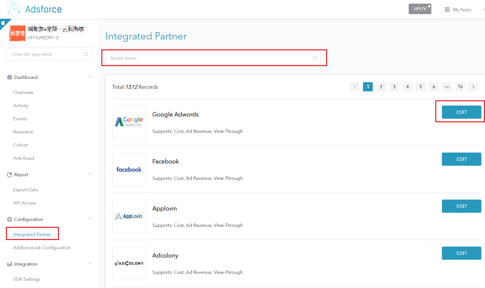
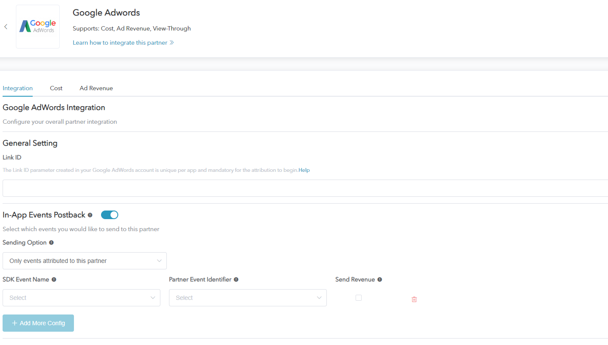
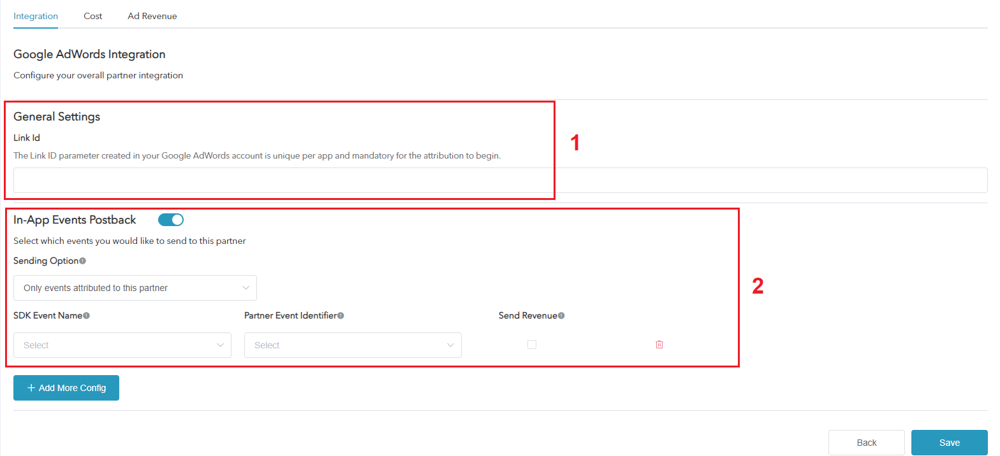
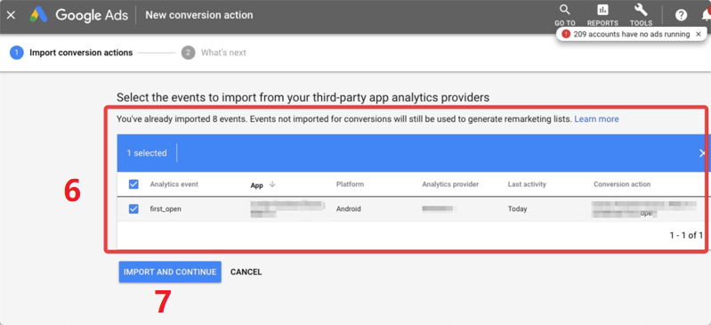

# How to Configure a Campaign with Google AdWords

* AdWords, one of Adsforce's integrated partners, is a leading provider of CPC, CPM, and publishing ads at designated sites;

* In addition to click-based performance analytics, AdWords also supports other types of performance analytics such as cost, ad revenue, and view-through .

## **AdWords Integration**

To configure your campaigns with Google Ads, follow the steps below.

### Set Up AdWords

###### 1. [Login Adsforce](https://demo-portal.adsforce.io/login);

###### 2. Click your App under "My Apps";

###### 3. Under "Configuration" > "Integrated Partner ", search "AdWords" and click "EDIT";

###### 4. Go to **AdWords'** configuration window.

AdWords' configuration window includes 3 options: `Integration`, `Cost`, `Ad Revenue`.

### AdWords Integration

> **[info] Important**
>
> You can get **performance analytics Data** after integration.

To start integration of Google Ads campaigns with Adsforce, follow these steps:

###### 1. Enter [Link ID](linkid/README.md);
###### 2. Select and configure Google Ads in-app events (if needed).

> **[success] Tip**
>
> **Link ID**
> Adsforce connects to AdWords via the link ID, which is taken from AdWords.
>
> **In-App Events Postback**
>
> * Open **In-App Events Postback** switch to send AdWords events;
>
> * For more details on In-App Events, click [here](https://docs.adsforce.io/en/in-app-events/).
>
> **Sending Option**
>
>  * Select `Only event attributed to this partner` for events coming **only** from users attributed to AdWords;
>
> * Select `Event attributed to any partner or oranganic` to have your **entire** user base available to be reported to AdWords;
>
> **Event Setting**
>
>   For in-app events, you need to set SDk Event Name, Partner Event Identifier, and Send Revenue.

### Cost Configuration
Your AdWords cost data will be enhanced through cost integration.

> **[info] Important**
>
> Make sure AdWords is authorized before enabling AdWords cost data.

###### 1. Get Cost Data

   To get AdWords cost data, you need to turn on **Get Cost Data**.

###### 2. Bind Google

  Click **Go to Google Authorization** to authorize AdWords;

###### 3. **Select Customers**

   Selecting customer ID helps speed up the acquisition of cost data.

> **[success] Tip**
>
> * Use Google's Business advertising account to authorize;
> * If you have more than 10 advertising accounts, bind the corresponding App advertising account for more quickly read data.

### Ad Revenue

Ad revenue data can be received from Admob through Ad revenue integration.

> **[info] Important**
>
> Make sure Admob is authorized before enabling AdWords advertise revenue.

 

###### 1. Get Ad Revenue Data

Here you can set performance analytics for Ad revenue data.

To get Admob Ad revenue data, you need to turn on **Get Ad Revenue Data**.

###### 2. Bind Google Admob

 Click **Go to Google Authorization** to authorize Admob.

### Import Conversion Events

You need to select the events to import from your third-party App analytics providers.

> **[info] Important**
>
> * If the first_open event cannot be found, check your AdWords settings page after **one** hours;
> * After link ID is created, the first_open event usually takes **one** hour to import.

The import steps are as follows:

###### 1. Go to [Google Ads Dashboard](<https://ads.google.com/>) and click "Tools & Settings" icon;

###### 2. Select "Conversions" under "MESUREMENT";

###### 3. Click plus button to add a new conversion action;

###### 4. Select the kind of conversions you want to track.

###### 5. After selecting "Third-party App analytics", click "CONTINUE";

###### 6. Select App's first_open Analytics event;

###### 7. Click "IMPORT AND CONTINUE".

