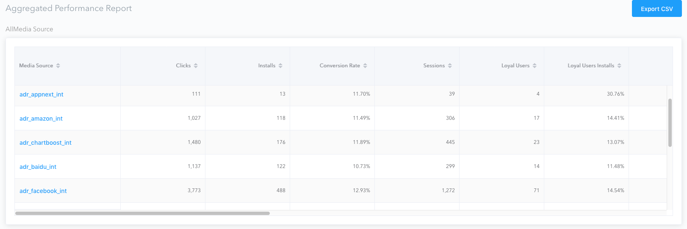

# Reporting

## Introduction

Adsforce's Partners Report provides aggregated performance reports per source/campaign.

Important: This lifetime value (LTV) report aggregates the overall (all time until present) performance of the installs/users generated during the reporting dates ( {from_date} to {to_date} ).

This means that the report includes all in-app events that occurred after the selected date range.

Report Time:UTC(GMT)

 

## The Report Parameters

The Partners/Media Source Report contains the following information.

| Column Name                               | Description                                                |
| ----------------------------------------- | ---------------------------------------------------------- |
| Media Source                              | Media source that generates the install                    |
| Country                                   | Installation country by IP                                 |
| Date                                      | Each date of the selected timeframe                        |
| Campaign                                  | Campaign name                                              |
| Impressions                               | Number of impressions                                      |
| Clicks                                    | Number of clicks                                           |
| Installs                                  | Number of installs                                         |
| Conversion Rate                           | Number of Total installs / number of clicks                |
| Sessions                                  | Number of app opens                                        |
| Loyal Users                               | Default - User who opens the app more than 3 times         |
| Loyal Users/Installs                      | Percentage of Loyal users from non organic installs        |
| Total revenue                             | Total revenue generated from the Media Source and Campaign |
| Cost                                      | The total cost                                             |
| ROI                                       | Return on Investment                                       |
| ARPU                                      | Average revenue per user                                   |
| Average eCPI                              | The average eCPI                                           |
| event:(Unique users)                      | Number of unique users who performed the event             |
| event:{your event name} (Event counter)   | Event counter                                              |
| event:{your event name} (Revenue)         | Event sales in USD                                         |
| event:{your event name} (Events/Installs) | Number of Events / Number of Installs                      |
| event:{your event name} (eCPA)            | Total cost / number of events                              |

A CSV report is available in the Adsforce Dashboard.

[table.xlsx](files/table.xlsx)

 

## Interpreting the Data

Adsforce provides ROI reports to help app marketers measure the effectiveness of their ad campaigns. By combining in-app activity and lifetime value data with ad cost and other campaign details, Adsforce can deliver real-time ROI reports on app install campaigns.

The ROI reports include additional data for measuring the effectiveness of your campaigns — campaign cost, clicks and in some cases impressions. Using the data, Adsforce also provides you with analysis of your campaign’s Return on Investment (ROI) and average Effective Cost per Installation (eCPI) over time.

| Column Name | Interpreting                                                 |
| ----------- | ------------------------------------------------------------ |
| Cost        | The total campaign cost                                      |
| ROI         | The return on your investment - the difference between the total campaign revenue and the campaign cost, as a percentage of the cost |
| eCPI        | The average effective cost per installation: the total campaign cost divided by the amount of effective installations (i.e., installations as a direct result of an ad click), as analyzed by Adsforce |
| ARPU        | The average revenue per user                                 |