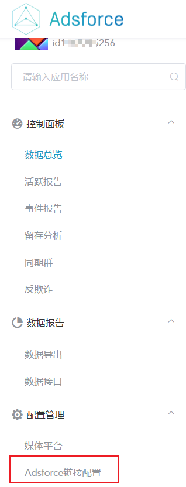
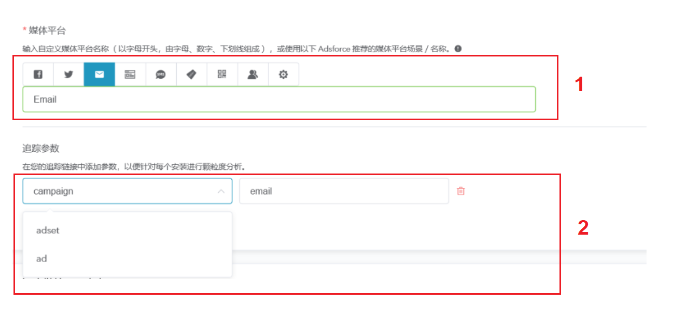
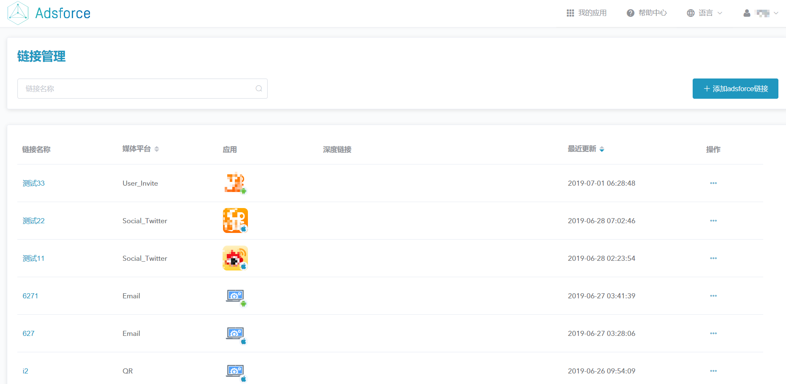
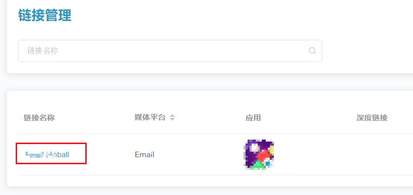
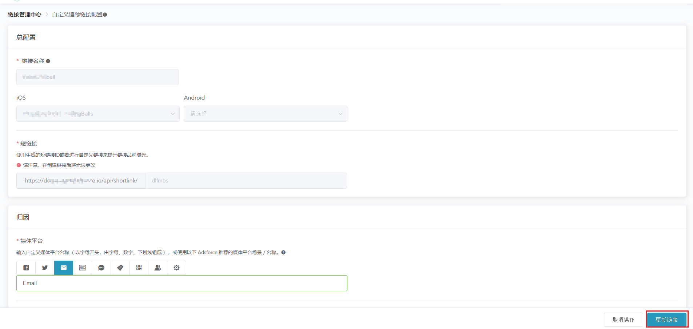
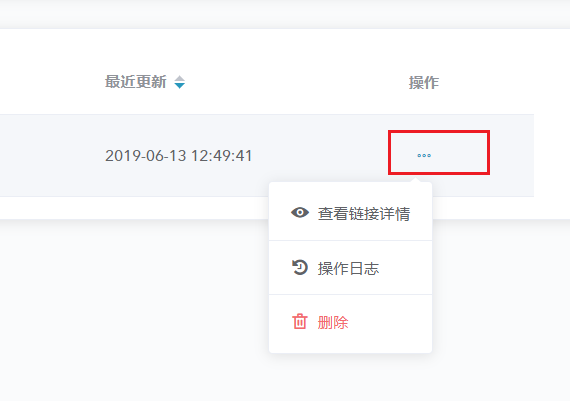
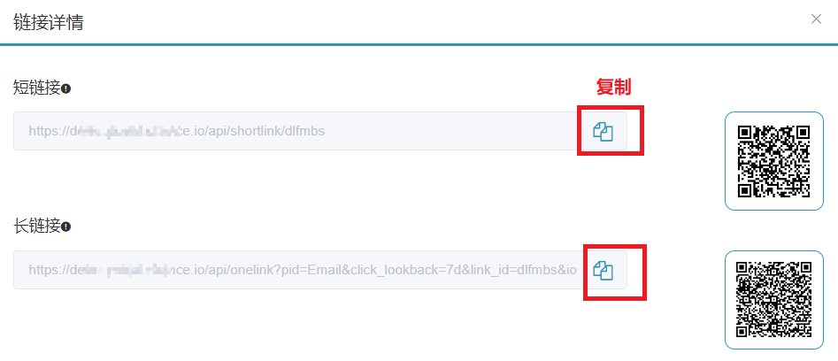

# Adsforce 链接配置

自定义追踪链接可对自有渠道进行追踪和监测、提高新用户获取数量，且能增强新用户活跃度。

## 链接创建

若要成功分析平台广告效果自有媒体，则需创建和管理自定义链接。

### 打开 Adsforce 链接配置窗口

##### 1. [登录 Adsforce 应用](<https://demo-portal.adsforce.io/login>)；

##### 2. 在“我的应用”列表项下，单击并选择需配置的应用程序；

##### 3. 在该应用程序参数配置页面，单击“配置管理” > “Adsforce 链接配置”；
&ensp;
##### 4. 进入“链接管理”配置页面。

### 创建链接

如未创建链接，需先创建链接：

#### 通用设置

##### 1. 在“链接管理”配置页面中，点击“添加 Adsforce 链接“按钮；

&ensp;

##### 2. 在“链接管理中心” > “自定义追踪链接配置”页面中，设定链接名称，以供查询；

&ensp;

##### 3. 选择需创建的链接类型（单选）；

&ensp;

##### 4. 链接自动生成一个**短链接**。

- 通过生成的短链接 ID 或自定义链接可提升链接品牌曝光度；
- 可同时选择一个 iOS  和一个 Android 应用或单选一个应用，生成链接预览。

> **[warning] 注意**
>
> 链接创建后不可更改。

&ensp;

#### 广告效果分析设置

###### 1. 设置媒体平台名称

在“媒体平台”项下，输入自定义媒体平台名称（以字母开头，由字母、数字、下划线组成）或点击使用 Adsforce 推荐的媒体平台场景／名称（如 “Email” ）。

> **[success] 提示**
>
> - 需正确区分自定义跟踪链接和 Adsforce 集成的合作伙伴跟踪链接，请勿使用 “Facebook”、“Facebook 广告”、“Google Adwords”、“Twitter” 或 “Organic” 作为自定义媒体源名称（大小写不敏感）；
> - 此类名称用于自定义跟踪链接可能会影响属性数据的完整性，因自有媒体类安装被归为集成的合作伙伴；
> - 输入格式应以字母开头，由字母（a~z / A~Z）、数字（0-9）和下划线（_）组成，首字母不能为数字。

###### 2. 广告效果分析参数设置

在“追踪参数”的追踪链接中添加参数，以对每个安装进行颗粒度分析。

> **[info] 重要信息**
>
> - campaign - 添加该参数以比较自有媒体的不同广告活动；
> - 广告集（adset）- 设置广告集名称可用于比较该媒体渠道某具体广告系列活动的不同广告集之间的表现；
> - 广告名称（ad）- 设置广告名称可用于比较该自有媒体平台某具体广告集中不同广告的表现。

#### 深度链接和重定向

##### 1. 深度链接

深度链接是指当用户打开应用时向其提供个性化的内容，或引导用户链接至应用内特定位置的操作。通过此操作，您可为用户提供优质的用户体验，从而增强用户与应用的互动。

通过输入 URL scheme 完成深度链接（af_dp)。

##### 2. 重定向

可将所有用户重定向至指定URL地址，而非跳转至商店。

通过点击“添加参数” > 选择“重定向参数” > 输入 “URL 地址” 实现重定向。

> **[success] 提示**
>
> 输入的 “URL 地址”应以 https:// 或 http:// 开头。

#### 高级设置

##### 自定义效果分析窗口期

开启 ***自定义效果分析窗口***开关可设置**最大点击至安装时间**。

点击效果分析窗口，即新安装效果分析的最长的 CTIT（点击到安装）窗口期。

默认窗口期：7 天。

##### 单次安装成本

启用并查看每个安装的全球花费值。

##### 货币

记录与此安装相关的成本的货币，按 https://finance.yahoo.com/currencies/ 当日汇率计算成本！

## 链接管理

链接管理配置界面是创建、编辑、删除和复制自定义效果分析链接的首选。

### 打开链接管理界面

##### 1. 在 Adsforce 控制面板，单击“配置管理” > “Adsforce 链接配置”；

##### 2. 进入“链接管理”页面（具体步骤详见“打开 Adsforce 链接配置窗口”章节）。

### 查看链接详情

#### 编辑现有链接

##### 1. 点击现有链接的名称以查看或修改其当前设置；

##### 2. 完成后, 点击“更新链接”。

#### 操作按钮

通过单击每个链接的***操作***按钮, 可执行以下操作:

##### 1. 查看链接详请：可显示已保存链接的长链接和短链接；

> **[warning] 注意**
>
> 在此页面上只能查看链接，不能修改链接；
> 
> 可通过点击*复制*按钮或扫描二维码来复制或下载短链接或长链接。

##### 2. 操作日志：可查看用户从第一次创建到最近一次编辑的历史日志；

##### 3. 删除：将链接从链接管理这个界面中删除，之前生成的链接仍可有效跳转。

### 长链接与短链接

- 短链接使广告系列具有有限的文本空间；
- 短链接可以随着 Adsforce 控制面板上的参数变更而动态地改变链接。

