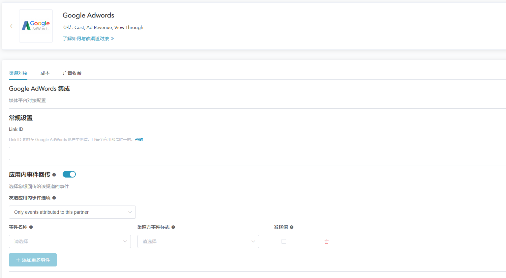
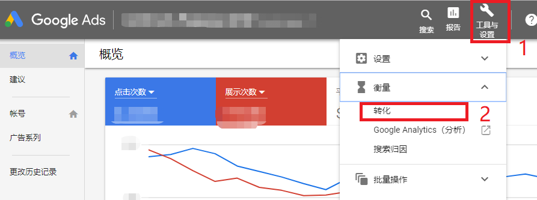
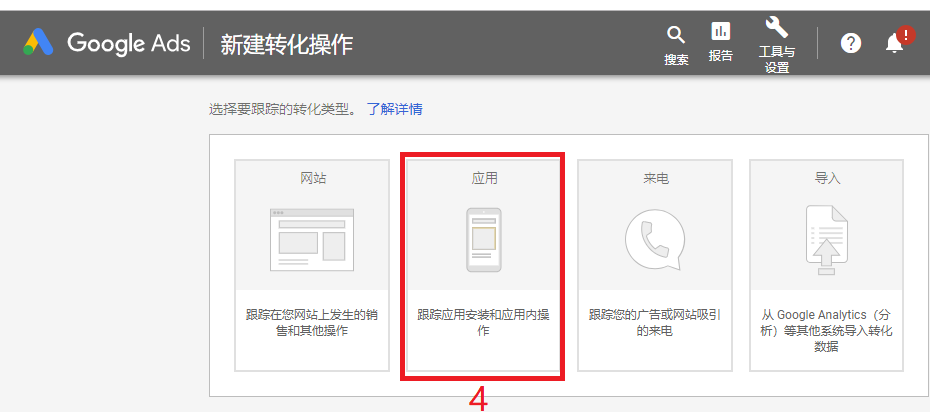
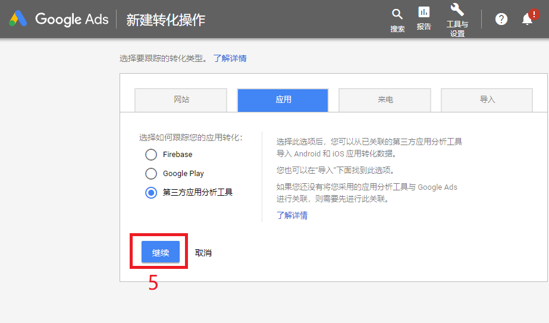

# **Google AdWords 追踪配置**

* AdWords 是 Adsforce 的集成合作伙伴之一，为广告主提供 CPC、CPM 和指定站点广告发布服务；

* 除点击效果分析外，AdWords 还提供成本、广告收益和曝光效果分析。

## **AdWords 追踪配置**

  如需配置 AdWords 请按以下步骤操作：

### 打开 AdWords 配置窗口

###### 1. [登录 Adsforce 应用](<https://demo-portal.adsforce.io/login>)；

###### 2. 在“我的应用”列表项下，单击并选择需配置的应用程序；

###### 3. 在“配置管理” > “媒体平台”配置页面，搜索 “AdWords” 并点击“编辑”按钮；

###### 4. 打开 **AdWords** 配置窗口。 

AdWords 配置窗口包括 3 个选项：`渠道对接`、`成本`、`广告收益` 。

### 渠道对接配置

> **[info] 重要信息**
>
> 渠道对接完成后，便可获取**效果分析数据**。

渠道对接配置方法如下：

###### 1. 输入[获取的链接编号](linkid/README.md)；
###### 2. 选择并配置 Facebook 应用内事件（如需要）。

> **[success] 提示**
>
> **链接 ID**
> Adsforce 是通过链接 ID 与 AdWords 连接，链接 ID 需从 AdWords 中获取。
> **应用内事件回传**
> * 您若想回传给 AdWords 的事件，请将其打开。
> * 关于应用内事件的详细信息，可以参考[此处](https://docs.adsforce.io/zh-hans/in-app-events/)。
> **发送应用内事件选项**
> * 若**仅回传 ** AdWords 中的效果分析数据，请选择`Only events attributed to this partner`
> * 若**回传所有**合作平台效果分析数据，请选择`Events attributed to any partner or oranganic`
> **事件设置**
> * 关于应用内事件，您需要设置事件名称、渠道方事件标志、发送值。

### 成本
通过成本对接，可优化 AdWords 推广成本数据。

> **[info] 重要信息**
>
> 在启用 Facebook 启用成本数据之前，请确保已授权 Facebook。

成本配置步骤如下：

###### 1. 获取成本数据

   如获取 AdWords 类成本数据，则需打开“获取成本数据”开关。

###### 2. 绑定 Google

   点击 “去 Google 授权” 按钮，进入 Google 授权页面。

###### 3. 选择广告账户

   选择广告账户后有助于加速获取成本数据。

> **[success] 提示**
>
> * 请使用 Google 的 Business 广告账号进行授权；
> * 如果您拥有超过 10 个广告账户，为更快捷的读取数据，请绑定对应的应用广告账户。

### 广告收益

通过广告收益对接，可从 Admob 获广告收益数据。

> **[info] 重要信息**
>
> 在启用 AdWords 广告收益之前，请确保已授权 AdWords。

广告收益配置步骤如下：
>  

###### 1. 获取广告收益数据

此处可切换广告收益数据的效果分析设置。

如需获取 AdWords 类广告收益数据，则需打开“获取广告收益数据”开关。

###### 2. 绑定 Google

 如需获取成本数据，请在 AdWords 授权。

### 导入转化事件

Google AdWords 设置完成后，须从第三方应用分析提供商。

> **[info] 重要信息**
>
> * 如未发现 first_open 事件，请在 **1** 小时后检查您的 AdWords 设置页；
> * 在创建链接 ID 后，first_open 事件通常需要 **1** 个小时才能导入。

导入步骤如下：

###### 1. 登录 [AdWords 信息中心](<https://ads.google.com/>)，点击帐户右上角的“工具与设置”图标；

###### 2. 在“衡量（MESUREMENT）”项目下，单击“转化（Conversions）”；

###### 3. 要添加新的转化操作，请单击加号按钮；

###### 4. 选择应用转换类型。

###### 5. 选择第三方应用分析选项后，点击 “继续” 按钮；

###### 6. 选择应用的 first_open Analytics 事件；

###### 7. 单击“导入并继续”。

