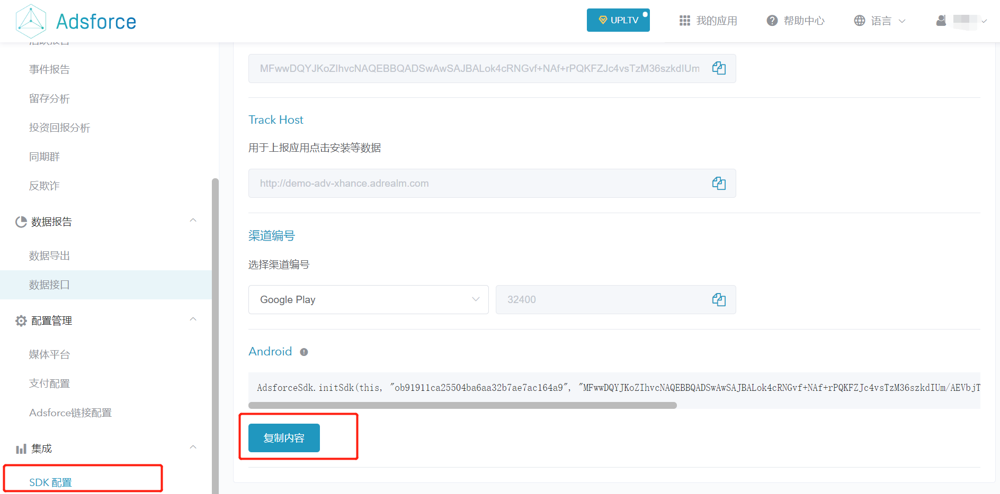
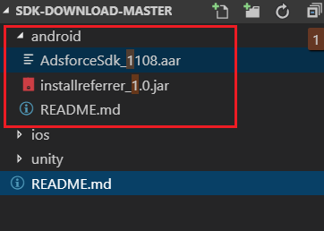
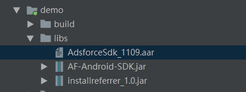
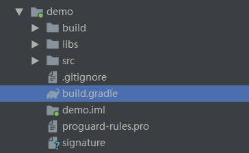
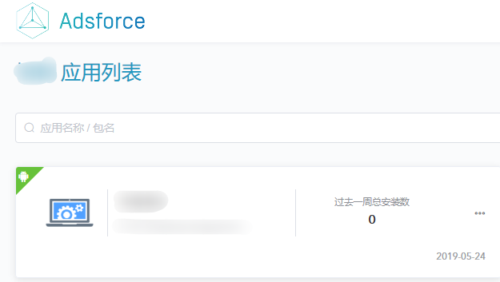
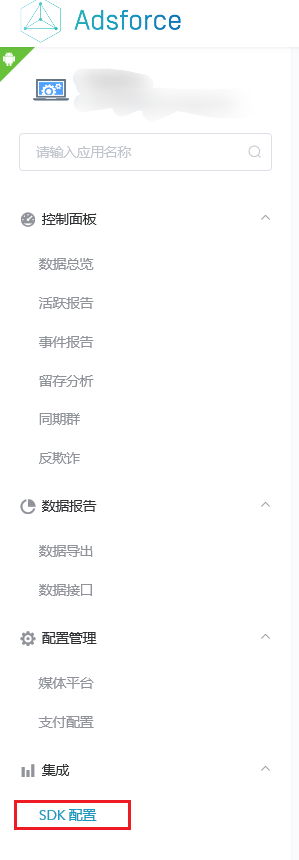
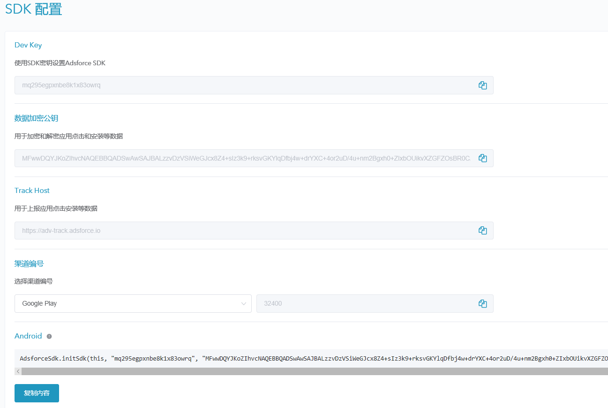

# Adsforce Android SDK

## 集成 Android SDK

|                         |                                                              |
| :---------------------: | :----------------------------------------------------------: |
|  |  <br><br>当前版本：<span style="color: blue;">1109</span>（[发布说明](/sdk-integrations/quick-start/Changelog/README.md)） |


## 概述

Android SDK 为移动应用提供安装和应用内事件的追踪。

可追踪安装、更新和互动以及应用安装以外的其他应用内事件（包括内购、游戏级别等），以评估 ROI 和用户互动水平。

## Android SDK 集成

> **[info] 重要信息**
>
> *Android SDK 集成前，应确认：*
>
> - 已[创建应用](../../../get-started/add-apps/README.md)应用至 Adsforce 应用平台；
>
> - 已获取应用 **SDK API Key**。

**Android SDK API Key** 获取方式：
###### 1. [登录Adsforce](https://demo-portal.adsforce.io/login)；

###### 2. 在“我的应用”项目下，单击选择需配置的应用；


###### 3. 在“集成” > “SDK 配置”项下，单击“复制内容”，复制该应用的 SDK API 密钥。



### 将 SDK 导入 Adsforce 主包

###### 1. 解压 [Adsforce SDK下载包](sdk-download/README.md)



###### 2. 将下载的`AdsforceSdk_xxx.aar` 和`installreferrer_xxx.jar` 添加至主包的 `libs` 目录中。



> **[success] 提示**
>
> - `installreferrer_xxx.jar`文件由谷歌平台提供，可安全检索安装；
> - 可从 Google Play 获取 API。


- 针对`Android Studio`构建的项目，请将以下编译语句添加至您的 app / build.gradle（不是主包项下！）；



   ```groovy
   repositories {
       flatDir {
           dirs 'libs'
       }
   }
   
   dependencies {
       compile(name: 'AdsforceSdk_xxx', ext: 'aar')
       compile(name: 'installreferrer_x.x.x', ext: 'jar')
       compile 'com.google.android.gms:play-services-base:15.0.1'
   }
   ```

- 如开发工具不支持`gradle`，但`aar`文件有效，可下载play-services的依赖库文件并将它们其添加至项目中；
  
- 如开发工具不支持`aar`文件，则在这种情况下不能使用`play-services-base`依赖库。 只需导入`installreferrer_xxx.jar`文件，解压`AdsforceSdk_xxx.aar`后，重命名`classes.jar`并将其导入项目。 最后将以下代码复制到项目的“AndroidManifest.xml”文件中。
  
     ```xml
     <uses-permission android:name="android.permission.INTERNET"/>
     <uses-permission android:name="android.permission.ACCESS_NETWORK_STATE"/>
     <uses-permission android:name="android.permission.ACCESS_WIFI_STATE"/>
     <uses-permission android:name="com.google.android.finsky.permission.BIND_GET_INSTALL_REFERRER_SERVICE" />
     ```
     
     

### **SDK 初始化**

###### 1. 在**[Adsforce](https://tmp-portal.adsforce.io/login)**上[创建你的应用](../../../get-started/Add-Apps/README.md)；

###### 2. 并在所创建的 SDK 配置页面获取 SDK 配置参数；

&ensp;&ensp;1）单击选择需配置的应用；



&ensp;&ensp;2）单击“集成” > “SDK 配置”；



&ensp;&ensp;3）在 SDK 配置页面，查询编辑生成的初始代码。



###### 3. 并在`Application.onCreate（）`中初始化`AdsforceSdk`。

 **示例代码：**


     public class MyApplication extends Application {
     
         @Override
         public void onCreate() {
             super.onCreate();
             AdsforceSdk.initSdk(this, "<your_dev_key>","<your_public_key>", "https://<your_track_host>/", "<your_channel_id>");
     	}
     }


### **追踪深度链接**

如需了解`deeplink`信息，可在初始化后调用以下代码来获取用户的`deeplink`信息。

    AdsforceSdk.getOneLink(getApplicationContext(), new AdsforceOneLinkCallback() {
                        @Override
                        public void onOneLinkCallback(String oneLink) {
                            if (oneLink != null) {
                                Log.i(TAG, "referrer oneLink is " + oneLink);
                            } else {
                                Log.i(TAG, "referrer oneLink is null");
                            }
                        }
                    });


​     
### 内购事件报告

如果内购使用`google payment`，可调用以下任意一种方法生成此事件报告。

方法一（推荐）
```
     /**
      * Recommend you to call the method below to report the in-app purchase record (Google-  certified)
      * @param skuDetailJson  IAP Skudeatail JSON string, can not be empty
      * @param publicKey      Public key of Google payment，can be empty
      * @param dataSignature  Signature verification from GP payment, get from Purchase.getSignature()，can not be empty
      * @param purchaseData   Signature verification from GP payment, get from Purchase.getOriginalJson()，can not be empty
      * @param params         Other params，can be empty
      */
    AdsforceSdk.googleZFReportWithSkuDetailJson(@NonNull String skuDetailJson,
                                                           String publicKey, @NonNull String dataSignature,
                                                           @NonNull String purchaseData, Map<String, String> params)
```

​    

方法二

    /**
      * Or you can call the follwing method to report the in-app purchase record (Google-certified)
      * @param price          Payment amount, recommended to take from the 'price' field of Skudetail, must be more than 0
      * @param currency       Payment currency，Payment amount, recommended to take from the 'price_currency_code' field of skudetail, can not be empty
      * @param publicKey      Public key of Google payment，can be empty
      * @param dataSignature  Signature verification from GP payment, get from Purchase.getSignature()，can not be empty
      * @param purchaseData   Signature verification from GP payment, get from Purchase.getOriginalJson()，can not be empty
      * @param params         Other params，can be empty
      */
     AdsforceSdk.googleZFReportWithProductPrice(double price, @NonNull String currency, String publicKey, @NonNull String dataSignature, @NonNull String purchaseData, Map<String, String> params);

> **[warning] 注意**
>
> 必须在初始化 SDK 后方可调用此方法。


### 第三方内购事件报告

如果内购使用第三方支付（`third-party payment`），可调用以下方法生成此事件报告。

     /**
      * In-app purchase record (custom)
      *
      * @param price        Payment amount, recommended to take from the 'price' field of skudetail, must be more than 0
      * @param currency     Payment currency，Payment amount, recommended to take from the 'price_currency_code' field of skudetail, can not be empty
      * @param productId    Id of product，recommended to take from the 'productId' field of skudetail，can be empty
      * @param productType  Type of product，recommended to take from the 'type' field of skudetail，can be empty
      */
    AdsforceSdk.thirdZFReportWithProductPrice(double price, @NonNull String currency, String productId, String productType);

> **[warning] 注意**
>
> 必须在初始化 SDK 后方可调用此方法。

### 自定义事件报告

可根据报告的参数类型，选择以下三种方法中的任意一种进行报告。

方法一 
     /**
      * Custom event report
      *
      * @param key   Key of event
      * @param value Data for reproting
      */
     AdsforceSdk.customerEventWithValue(String key, String value);


方法二  

     /**
      * Custom event report
      *
      * @param key Key of event
      * @param map Use HashMap for reproting
      */
     AdsforceSdk.customerEventWithMap(String key, HashMap<String, String> map);


方法三

     /**
      * Custom event report
      *
      * @param key  Key of event
      * @param list Use Arraylist for reproting
      */
     AdsforceSdk.customerEventWithList(String key, ArrayList<String> list);

> **[warning] 注意**
>
> 必须在初始化 SDK 后方可调用此方法。

## 设置 AndroidId

> **[warning] 注意**
>
> 必须在初始化 SDK **前**调用此方法。

为了确保数据的准确性，请保证用户隐私安全，并调用以下方法将`AndroidId`传递给我们。

     AdsforceSdk.setAndroidId(getApplicationContext(), getAndroidId());

   


